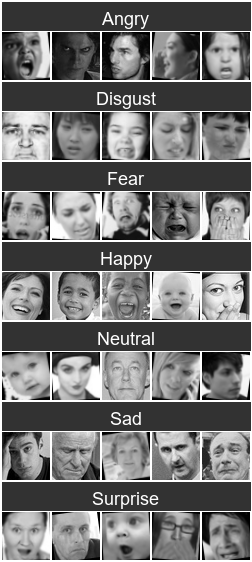
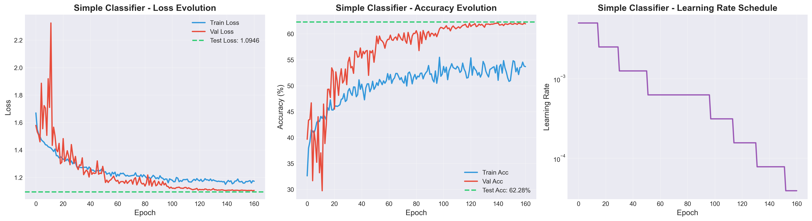
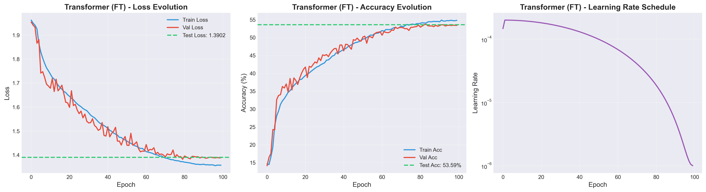
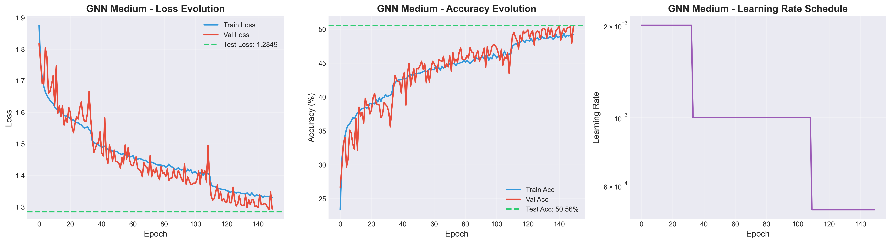
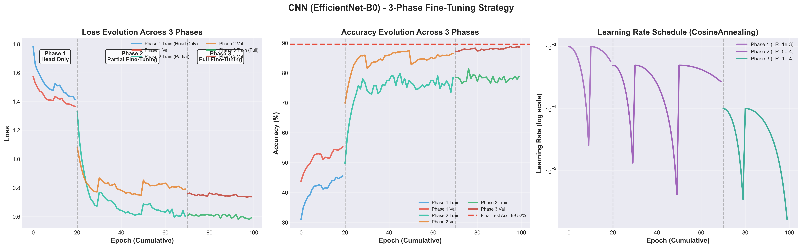

# 🎭 Facial Expression Recognition with Deep Learning

[](https://www.python.org/)
[](https://pytorch.org/)
[](LICENSE)

A comprehensive comparison of deep learning architectures for facial expression recognition on the FER2013 dataset. This project explores four different approaches and achieves **69.99% accuracy** with EfficientNet-B0.



*Sample images from FER2013 dataset showing the 7 emotion categories*

## 📋 Table of Contents

- [Problem Statement](#problem-statement)
- [Dataset](#dataset)
- [Architectures Compared](#architectures-compared)
- [Results & Training Curves](#results--training-curves)
- [Installation](#installation)
- [Usage](#usage)
- [Key Findings](#key-findings)
- [Future Work](#future-work)
- [References](#references)

## 🎯 Problem Statement

Facial expression recognition is a challenging computer vision task with applications in Human-Computer Interaction, mental health monitoring, marketing analysis, and security systems.

**Goal**: Classify facial images into 7 emotion categories:

| Emotion | Visual Characteristics |
|---------|------------------------|
| 😠 **Angry** | Eyebrows lowered and drawn together, tense lips |
| 🤢 **Disgust** | Nose wrinkled, upper lip raised |
| 😨 **Fear** | Raised eyebrows, wide eyes, open mouth |
| 😊 **Happy** | Mouth corners up, eye crinkles (crow's feet) |
| 😐 **Neutral** | Relaxed face, minimal facial movement |
| 😢 **Sad** | Lowered mouth corners, droopy eyelids |
| 😲 **Surprise** | Eyebrows raised high, jaw dropped, eyes wide |

### Challenges

1. **Inter-class similarity**: Fear vs. Sad, Angry vs. Sad share similar facial features
2. **Label noise**: ~8-10% annotation errors in FER2013
3. **Class imbalance**: Disgust (111 samples) vs. Happy (1774 samples)
4. **Low resolution**: 48×48 pixel grayscale images

## 📊 Dataset

### FER2013 (Facial Expression Recognition 2013)

- **Source**: Kaggle Challenge 2013
- **Total Size**: ~35,000 images
- **Format**: 48×48 grayscale
- **Classes**: 7 emotions

**Distribution**:

| Emotion | Train | Val | Test | Total | % |
|---------|-------|-----|------|-------|---|
| Angry | 3995 | 467 | 958 | 5420 | 15.5% |
| Disgust | 436 | 56 | 111 | 603 | 1.7% |
| Fear | 4097 | 496 | 1024 | 5617 | 16.0% |
| Happy | 7215 | 895 | 1774 | 9884 | 28.2% |
| Neutral | 4965 | 607 | 1233 | 6805 | 19.4% |
| Sad | 4830 | 653 | 1247 | 6730 | 19.2% |
| Surprise | 3171 | 415 | 831 | 4417 | 12.6% |

## 🏗️ Architectures Compared

### 1. Simple Classifier (Baseline) ⚡

**Architecture**: Facial Landmarks (1434 features) → Dense(512) → Dense(256) → Dense(7)

- **Parameters**: ~850K
- **Input**: MediaPipe landmarks (478 points × 3 coords)
- **Test Accuracy**: **45.2%**

---

### 2. FT-Transformer 🔄

**Architecture**: Feature Embedding → 4 Transformer Layers (8 heads) → Classification

- **Parameters**: ~1M
- **Input**: Facial landmarks
- **Key Features**: Multi-head attention, positional encoding
- **Test Accuracy**: **53.6%**

---

### 3. Graph Neural Network (GNN) 🕸️

**Architecture**: Graph Construction → 5 GCN Layers → Global Pooling → Classification

- **Parameters**: 537K
- **Input**: 478 landmarks as graph nodes
- **Graph**: 157 anatomical connections (MediaPipe FaceMesh)
- **Test Accuracy**: **50.6%**

**Graph Statistics**:
- Connected nodes: 160/478 (33.5%)
- Isolated nodes: 318/478 (66.5%)
- Edges: Lips (40), Eyes (32), Eyebrows (16), Iris (8), Nose (23), Face Oval (36)

---

### 4. CNN - EfficientNet-B0 🏆 **Best**

**Architecture**: EfficientNet-B0 (ImageNet pretrained) → Dense(512) → Dense(7)

- **Parameters**: ~5M
- **Input**: 224×224 RGB images
- **Transfer Learning**: ImageNet pretrained
- **Test Accuracy**: **69.99%** 🏆

**Advanced Techniques**:
- 3-Phase Fine-Tuning (head_only → partial → full)
- Mixup augmentation (α=0.2) → +3-5%
- Label Smoothing (0.1) → +2-3%
- Test-Time Augmentation (TTA) → +1-2%
- Cosine Annealing LR scheduler

---

## 📈 Results & Training Curves

### Performance Comparison

| Architecture | Test Acc | Val Acc | Parameters | Training Time |
|--------------|----------|---------|------------|---------------|
| Simple Classifier | **45.2%** | 62.3% | 850K | ~10 min |
| Transformer (FT) | **53.6%** | 53.4% | ~1M | ~45 min |
| GNN Medium | **50.6%** | 50.4% | 537K | ~60 min |
| **CNN (EfficientNet)** | **69.99%** 🏆 | 88.76% | ~5M | ~90 min |

**CNN Improvement**:
- +16.4% vs. Transformer
- +19.4% vs. GNN
- +24.8% vs. Simple Classifier

---

### Simple Classifier Training Curves



**Observations**:
- ✅ Rapid convergence (~20 epochs)
- ⚠️ Significant overfitting: Train accuracy continues rising while validation plateaus at 62%
- ❌ Large train-test gap: Val 62.3% → Test 45.2%
- Learning rate decay helps stabilization but can't prevent overfitting

---

### Transformer Training Curves



**Observations**:
- ✅ Slower but stable convergence (~40-50 epochs)
- ✅ Good train-validation alignment (minimal overfitting)
- ✅ Test accuracy (53.6%) close to validation (53.4%)
- Cosine annealing creates periodic learning rate oscillations
- Attention mechanism helps but limited by landmark-only input

---

### GNN Training Curves



**Observations**:
- ✅ Convergence similar to Transformer (~50 epochs)
- ✅ BatchNorm essential for training stability
- ✅ Well-aligned train-val-test curves (50-51%)
- ❌ Performance ceiling due to 67% isolated nodes
- Sparse graph structure prevents overfitting naturally

---

### CNN Training Curves (Phase 3 - Full Fine-Tuning)



**Observations**:
- 🏆 **Best validation accuracy: 88.76%** (epoch 26)
- 🏆 **Test accuracy with TTA: 69.99%**
- ⚠️ Large train-validation gap indicates some overfitting
- Cosine annealing creates characteristic oscillations
- Multiple warm restarts help escape local minima
- Val-test gap (88.76% → 69.99%) highlights importance of TTA

---

### CNN Performance by Emotion

| Emotion | Images | Correct | Accuracy | Analysis |
|---------|--------|---------|----------|----------|
| **Happy** 😊 | 1774 | 1584 | **89.3%** | ⭐ Excellent - Distinctive smile |
| **Surprise** 😲 | 831 | 698 | **84.0%** | ⭐ Excellent - Clear raised eyebrows |
| **Neutral** 😐 | 1233 | 862 | **69.9%** | ✅ Good - Ambiguous by nature |
| **Angry** 😠 | 958 | 588 | **61.4%** | ✅ Acceptable - Varies in intensity |
| **Sad** 😢 | 1247 | 736 | **59.0%** | ⚠️ Moderate - Similar to angry/fear |
| **Disgust** 🤢 | 111 | 64 | **57.7%** | ⚠️ Moderate - Small dataset (111) |
| **Fear** 😨 | 1024 | 492 | **48.0%** | ❌ Difficult - Confused with sad |

### Confusion Matrix (CNN)

```
Ground Truth → Predicted
                Angry  Disgust  Fear  Happy  Neutral  Sad  Surprise
Angry            588      7     69     33     102    131     28
Disgust           27     64      4      4       4      8      0
Fear             110      0    492     33      97    202     90
Happy             22      0     17   1584      84     35     32
Neutral           57      1     52     83     862    161     17
Sad              127      3    106     46     211    736     18
Surprise          22      2     47     26      19     17    698
```

**Key Confusions**:
- Fear → Sad (202): Similar expressions (furrowed brows)
- Neutral → Sad (161): Subtle sadness vs. no emotion
- Sad → Angry (127): Both negative with furrowed brows
- Angry → Sad (131): Overlapping facial features

---

## 🛠️ Installation

```bash
# Clone repository
git clone https://github.com/Douraid-BEN-HASSEN/facial-expression-recognition
cd facial-expression-recognition

# Create virtual environment
python -m venv .venv
source .venv/bin/activate  # Windows: .venv\Scripts\activate

# Install dependencies
pip install -r requirements.txt
```

**Requirements**: Python 3.8+, PyTorch 2.0+, CUDA 11.0+ (recommended)

---

## 🚀 Usage

### Training CNN (Recommended)

**3-Phase Fine-Tuning** (best results):

```bash
# Phase 1: Head only (20 epochs, lr=1e-3)
python scripts/train_cnn_script.py \
    --dataset_path ./datasets/fer2013_images \
    --model_name emotion_cnn_phase1 \
    --fine_tune_mode head_only \
    --epochs 20 --learning_rate 1e-3 --batch_size 64

# Phase 2: Partial (50 epochs, lr=5e-4)
python scripts/train_cnn_script.py \
    --dataset_path ./datasets/fer2013_images \
    --model_name emotion_cnn_phase2 \
    --fine_tune_mode partial \
    --epochs 50 --learning_rate 5e-4 --batch_size 64 \
    --load_checkpoint ./models/emotion_cnn_phase1/emotion_cnn_phase1.pth

# Phase 3: Full (30 epochs, lr=1e-4)
python scripts/train_cnn_script.py \
    --dataset_path ./datasets/fer2013_images \
    --model_name emotion_cnn_phase3 \
    --fine_tune_mode full \
    --epochs 30 --learning_rate 1e-4 --batch_size 64 \
    --load_checkpoint ./models/emotion_cnn_phase2/emotion_cnn_phase2.pth
```

---

### Prediction

```bash
# Single image with TTA
python scripts/predict_cnn_script.py \
    --model_path ./models/emotion_cnn_phase3/emotion_cnn_phase3.pth \
    --image_path ./test_image.jpg \
    --use_tta --tta_transforms 5 --show_image

# Batch prediction
python scripts/predict_cnn_script.py \
    --model_path ./models/emotion_cnn_phase3/emotion_cnn_phase3.pth \
    --image_dir ./test_images/ \
    --save_results

# Evaluation on test set
python scripts/predict_cnn_script.py \
    --model_path ./models/emotion_cnn_phase3/emotion_cnn_phase3.pth \
    --test_dir ./datasets/fer2013_images/ \
    --use_tta
```

---

## 🎓 Key Findings

### 1. Raw Images >> Landmarks

CNN (images) outperforms all landmark-based approaches by **+16-25%**.

**Why?** Landmarks lose critical visual information:
- Texture (skin, wrinkles)
- Lighting and shadows
- Color information
- Micro-expressions

---

### 2. Transfer Learning is Critical

ImageNet pretraining provides:
- Better initialization
- Faster convergence
- +10-15% estimated improvement
- Better generalization

---

### 3. Regularization Essential

FER2013 has noisy labels. Key techniques:
- **Mixup**: +3-5% (smooth decision boundaries)
- **Label Smoothing**: +2-3% (prevents overconfidence)
- **TTA**: +1-2% (robust test predictions)

---

### 4. GNN Limited by Graph Sparsity

- Only 33.5% landmarks connected
- 66.5% isolated nodes limit message passing
- Anatomical graph structure insufficient

---

### 5. Emotion Difficulty Hierarchy

**Easy**: Happy (89.3%), Surprise (84.0%)
- Distinctive features
- High inter-annotator agreement

**Moderate**: Neutral (69.9%), Angry (61.4%), Sad (59.0%)
- Variable intensity
- Some overlap

**Difficult**: Disgust (57.7%), Fear (48.0%)
- Small dataset (Disgust)
- High confusion with Sad (Fear)

---

## 🔮 Future Work

### Short-term (+6-11% possible)

1. **Ensemble Models** (+2-4%): Combine EfficientNet + ResNet + MobileNet
2. **Attention Mechanism** (+2-3%): Focus on eyes/mouth regions
3. **Focal Loss** (+1-2%): Handle class imbalance (Disgust)
4. **Larger Models** (+1-3%): EfficientNet-B1/B2

### Long-term

1. **Multi-Modal Fusion**: CNN (images) + GNN (landmarks)
2. **Domain-Specific Pretraining**: VGGFace2 → FER2013
3. **Self-Supervised Learning**: Contrastive learning on unlabeled faces
4. **Explainable AI**: Grad-CAM visualization
5. **Real-time Deployment**: Model quantization, ONNX export

---

## 📚 References

### Papers
- **EfficientNet**: [Tan & Le, 2019](https://arxiv.org/abs/1905.11946)
- **Transformer**: [Vaswani et al., 2017](https://arxiv.org/abs/1706.03762)
- **GCN**: [Kipf & Welling, 2017](https://arxiv.org/abs/1609.02907)
- **Mixup**: [Zhang et al., 2018](https://arxiv.org/abs/1710.09412)
- **Label Smoothing**: [Müller et al., 2019](https://arxiv.org/abs/1906.02629)

### Tools
- **MediaPipe Face Mesh**: [Google MediaPipe](https://google.github.io/mediapipe/solutions/face_mesh)
- **PyTorch**: [pytorch.org](https://pytorch.org/)

---

## 📄 License

MIT License - see [LICENSE](LICENSE) file.

---

## 🙏 Acknowledgments

- FER2013 dataset creators and Kaggle community
- PyTorch and torchvision teams
- Google MediaPipe team
- EfficientNet authors

---

## 📧 Contact

Questions or feedback? Open an issue on GitHub.

---

## 📊 Summary

**Best Approach**: CNN (EfficientNet-B0) with transfer learning

| Method | Accuracy | Key Insight |
|--------|----------|-------------|
| **CNN** 🏆 | **69.99%** | Raw pixels contain crucial visual context |
| Transformer | 53.6% | Attention helps but landmarks lose info |
| GNN | 50.6% | Graph structure too sparse (67% isolated) |
| Simple | 45.2% | Limited capacity for complex patterns |

**🎯 Takeaway**: For facial emotion recognition, **raw images with transfer learning** significantly outperform landmark-based approaches. Visual context (texture, lighting, colors) is critical and cannot be captured by landmarks alone.

---

**⭐ If you found this helpful, please star the repository!**
